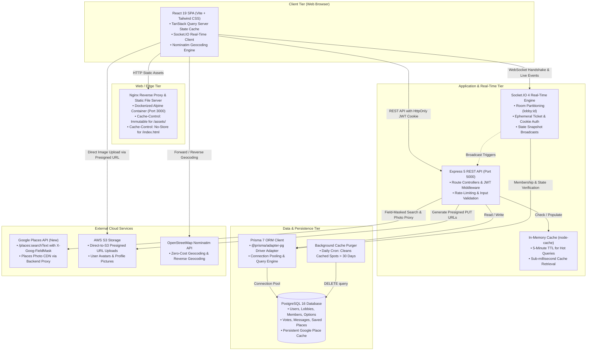
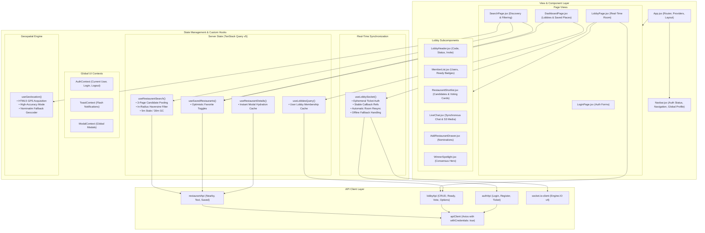
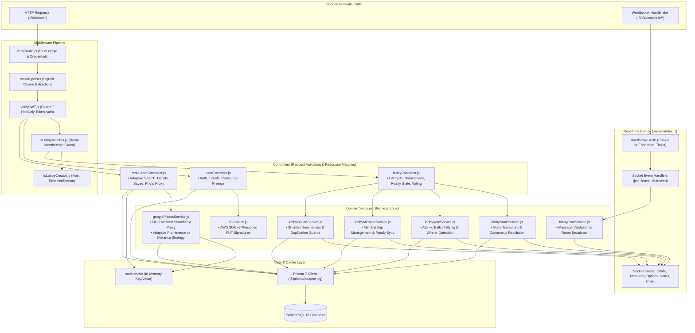
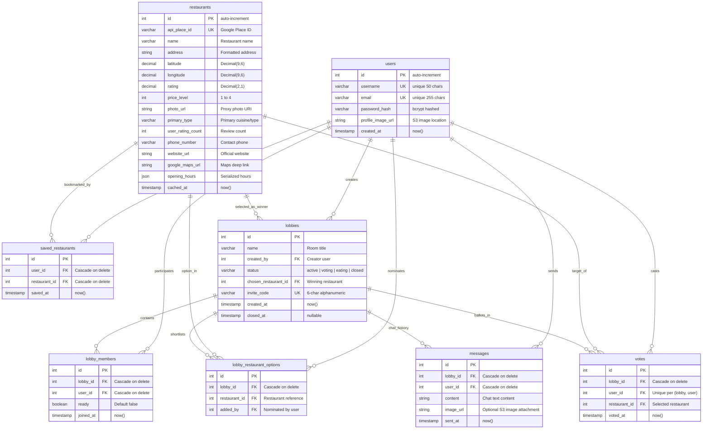
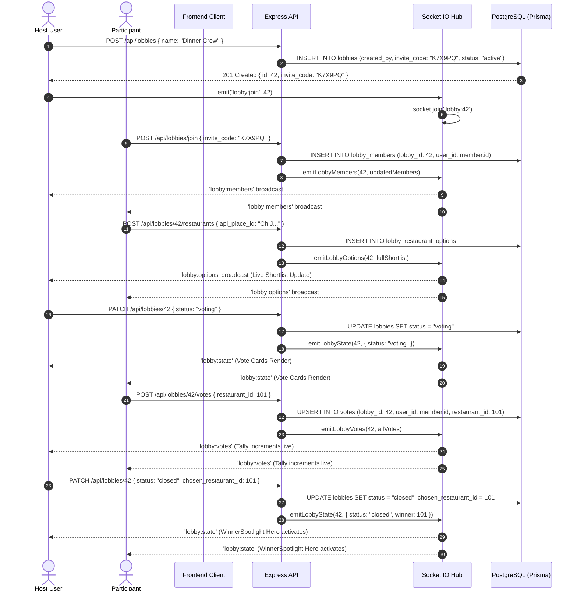
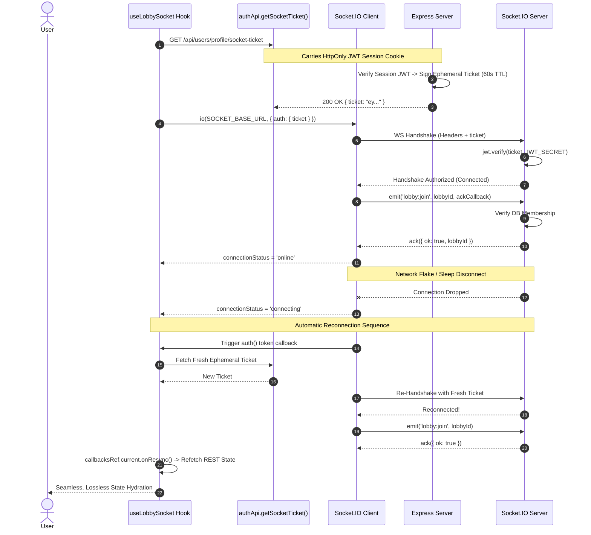
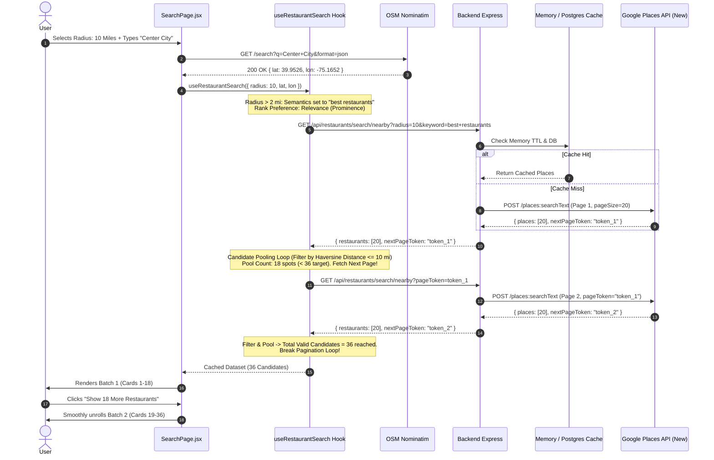
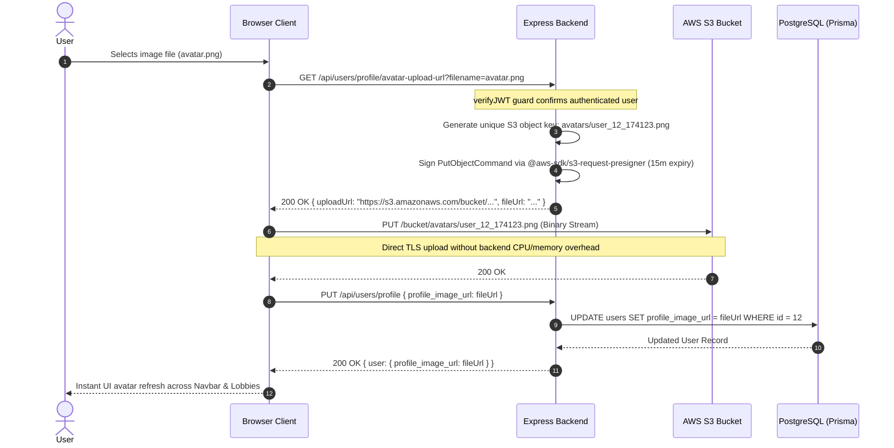

# FoodFinder Architecture & Technical Specifications

FoodFinder is a high-performance, real-time collaborative restaurant discovery, shortlisting, and consensus voting application. It solves the group coordination dilemma ("Where should we eat?") through synchronous geospatial search, multi-user shortlist curation, live chat, and instant democratic voting.

---

## 1. High-Level System Architecture

The application is architected around a decoupled client-server model optimized for low-latency WebSocket events, efficient external API utilization, and horizontal scalability.



---

## 2. Frontend Architecture (React 19 + Vite)

The frontend is a single-page application (SPA) built on React 19 and Vite 6, using a modular hook-driven architecture that strictly separates UI rendering from server state management.



### Frontend State Segregation
1. **Server State (TanStack Query v5):** All data sourced from the backend (`restaurants`, `saved_restaurants`, `lobbies`, `details`) is managed via TanStack Query with structured query keys (`queryKeys.restaurants.search(...)`). Stale times are tuned to 5 minutes, eliminating redundant API hits during active navigation.
2. **Ephemeral Real-Time State (Socket.IO Hook):** Live lobby membership, shortlist mutations, vote tallies, and chat messages are handled by `useLobbySocket`. Stable callback refs (`callbacksRef.current`) prevent unwanted socket teardowns and reconnections across re-renders.
3. **Session & Global UI Context:** Pure client state (authentication status, notification toasts, confirmation dialogs) lives in lightweight React Context providers.
4. **URL Synchronization:** Search query parameters (`q`, `cuisine`, `radius`, `lat`, `lng`, `customLoc`, `mode`) are mirrored in `URLSearchParams`, enabling direct bookmarking and shareable discovery states.

---

## 3. Backend Architecture (Express 5 + Socket.IO)

The backend is built with modern ES Modules (Node.js 24+) following a layered separation of concerns:



---

## 4. Database Schema (Prisma 7 / PostgreSQL)

The database schema models user identities, cached restaurant entities, collaborative lobby sessions, shortlists, live ballots, and messages.



---

## 5. Detailed Execution Workflows & Sequence Diagrams

### 5.1 Real-Time Collaborative Lobby & Voting Consensus Flow

This flow illustrates the synchronous lifecycle of a room: from host creation and member joins to nominations, status transitions, live ballot updates, and final consensus spotlighting.



---

### 5.2 Ephemeral Socket Ticket Authentication & Reconnection Resync

To ensure cross-origin security and support reliable reconnections across mobile or unreliable networks without exposing session credentials, FoodFinder utilizes an ephemeral socket ticket protocol.



---

### 5.3 Adaptive Restaurant Search & 3-Page Candidate Pooling

FoodFinder utilizes an adaptive search algorithm that optimizes query semantics based on search distance, pooling candidates across up to 3 Google Places API pages to ensure an exact 18+18 two-batch grid layout.



---

### 5.4 Direct-to-S3 Presigned Media Upload Flow

To keep the Express backend stateless, memory-efficient, and capable of high concurrency, profile avatar uploads bypass backend file buffers entirely.



---

## 6. Security & Protection Architecture

1. **Authentication & Session Tokens:**
   - Stateless JWT tokens signed with `HS256` secret (`JWT_SECRET`).
   - Transported via `HttpOnly`, `SameSite=Lax` browser cookies, immunizing the application against cross-site scripting (XSS) credential theft.
   - In production environments, `secure: true` enforces HTTPS-only cookie transmission.
2. **WebSocket Single-Use Ephemeral Tickets:**
   - Eliminates the vulnerability of passing long-lived credentials over WebSocket handshakes.
   - Tickets are signed with a 60-second expiration window and verified strictly against the user ID in the database.
3. **Third-Party API Masking & Key Secrecy:**
   - The Google Places API key is never exposed to the frontend.
   - All external restaurant requests are brokered through the backend `/api/restaurants` proxy.
   - Image assets are proxied through `/api/restaurants/photo/:photoName`, shielding the client from upstream billing parameters and token leaks.
4. **Strict Authorization Guards:**
   - Multi-tiered middleware verification: `verifyJWT` -> `isLobbyMember` -> `isLobbyCreator`.
   - Ensures users cannot modify lobby settings, view room messages, or vote in lobbies they are not actively a part of.

---

## 7. Infrastructure & Deployment Topology

The application is structured for production deployment across Dockerized container platforms (e.g., AWS ECS, Google Cloud Run, or Kubernetes).

```mermaid
graph LR
    subgraph Internet["Public Internet"]
        ClientTraffic["HTTPS Client Requests"]
    end

    subgraph CDNEdge["Nginx Edge Container (Port 3000)"]
        StaticServer["Nginx 1.27 Alpine<br/>• Static React Bundle Assets<br/>• Brotli / Gzip Compression<br/>• Cache Control Headers"]
    end

    subgraph AppContainer["Express API Container (Port 5000)"]
        NodeRuntime["Node.js 24 Alpine<br/>• Express 5 Application<br/>• Socket.IO Real-Time Engine<br/>• node-cache Memory Store<br/>• Daily Cron Job"]
    end

    subgraph ManagedCloud["Managed Cloud Services"]
        PostgresInstance[("Managed PostgreSQL 16<br/>(e.g., AWS RDS / Cloud SQL)<br/>• Connection Pooling via Prisma<br/>• Automated Daily Snapshots")]
        S3Bucket["AWS S3 Bucket<br/>• CORS Configured for Direct PUT<br/>• Public Read Policy on /avatars/"]
        GoogleCloud["Google Cloud Platform<br/>• Places API (New) Quota / Billing"]
    end

    ClientTraffic -->|Port 3000| StaticServer
    ClientTraffic -->|Port 5000| NodeRuntime
    NodeRuntime --> PostgresInstance
    NodeRuntime --> GoogleCloud
    NodeRuntime --> S3Bucket
    ClientTraffic -->|Direct PUT (Avatars)| S3Bucket
```

### Cache & Performance Specifications
- **Client Cache (HTTP):** Static JS/CSS chunks compiled by Vite use content hashing with `Cache-Control: public, max-age=31536000, immutable`. The entry point `index.html` is served with `Cache-Control: no-cache, no-store, must-revalidate` to prevent stale bundle references.
- **Client Cache (TanStack Query):** Restaurant searches retain a 5-minute `staleTime` and 30-minute `gcTime`. Reopening an inspected restaurant details modal serves instantly from memory.
- **Backend Cache (L1 Memory):** In-memory `node-cache` caches recent restaurant detail responses with a 5-minute TTL.
- **Backend Cache (L2 Relational):** Google Places search results and detail queries are asynchronously persisted to the PostgreSQL `restaurants` table.
- **Scheduled Maintenance:** A scheduled cron job executes daily to purge cached restaurant entries older than 30 days (`cached_at < NOW() - INTERVAL '30 days'`), preventing database bloat while respecting Google API data caching terms.
